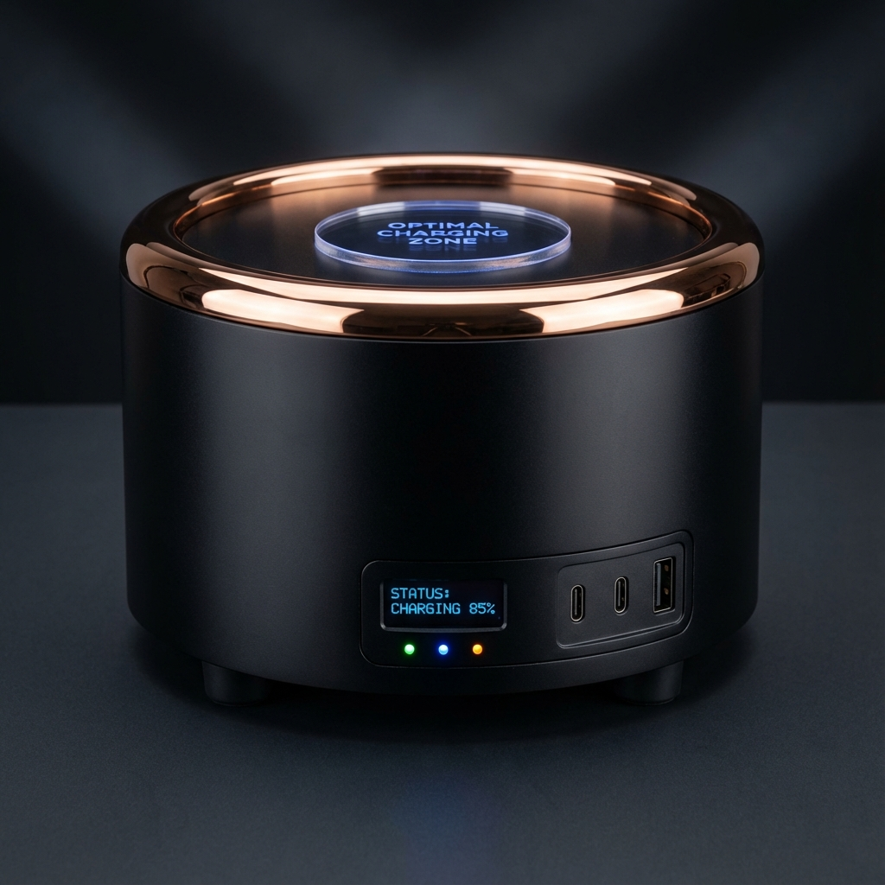

# 🔋 ADPS-100 Aetheric Desktop Power Station



## 🚀 QUICK START: Get This Device Manufactured

**This repository contains EVERYTHING you need to have ONE manufacturer build you a complete, assembled, working device.**

---

## 📧 STEP 1: Copy The Email

Open this file and copy the ENTIRE contents:
**[📄 1_EMAIL_TEXT_COPY_THIS.txt](SEND_TO_MANUFACTURER/1_EMAIL_TEXT_COPY_THIS.txt)**

This email is in **English + Chinese (中文)** and clearly states:

- ✅ You want ONE manufacturer to do EVERYTHING
- ✅ You want a FINISHED, ASSEMBLED device delivered
- ✅ You are NOT assembling yourself
- ✅ You are NOT coordinating multiple suppliers

---

## 📎 STEP 2: Attach Manufacturing Files

Download and attach these 8 files to your email:

| File                                                                      | Description                  |
| ------------------------------------------------------------------------- | ---------------------------- |
| [2_PCB_GERBERS.zip](SEND_TO_MANUFACTURER/2_PCB_GERBERS.zip)               | PCB fabrication files        |
| [3_PCB_BOM.csv](SEND_TO_MANUFACTURER/3_PCB_BOM.csv)                       | Parts list with LCSC numbers |
| [4_ENCLOSURE_CAD.zip](SEND_TO_MANUFACTURER/4_ENCLOSURE_CAD.zip)           | 3D CAD files (STEP + DXF)    |
| [5_TECHNICAL_DRAWINGS.md](SEND_TO_MANUFACTURER/5_TECHNICAL_DRAWINGS.md)   | Dimensions & specifications  |
| [6_COIL_SPECIFICATIONS.md](SEND_TO_MANUFACTURER/6_COIL_SPECIFICATIONS.md) | Coil winding instructions    |
| [7_ASSEMBLY_MANUAL.md](SEND_TO_MANUFACTURER/7_ASSEMBLY_MANUAL.md)         | Assembly instructions        |
| [8_FIRMWARE.hex](SEND_TO_MANUFACTURER/8_FIRMWARE.hex)                     | STM32 program file           |
| [9_DEVICE_PREVIEW.png](SEND_TO_MANUFACTURER/9_DEVICE_PREVIEW.png)         | Product render               |

---

## 🏭 STEP 3: Find a Manufacturer on Alibaba

**Search on [Alibaba.com](https://www.alibaba.com) for:**

- "Turnkey electronics assembly prototype"
- "OEM electronic device manufacturing"
- "Electronic prototype one-stop service Shenzhen"

**Filter by:**

- ✅ Trade Assurance
- ✅ Verified Supplier
- ✅ Response rate >90%

**IMPORTANT: Make sure they can do:**

- PCB fabrication + component assembly
- CNC aluminum machining
- Custom coil winding
- Final device assembly + testing

---

## 💰 Expected Costs

| Service            | Estimated Cost        |
| ------------------ | --------------------- |
| PCB + Assembly     | $50-100               |
| CNC Enclosure      | $150-250              |
| Copper Parts       | $30-50                |
| Custom Coils       | $40-80                |
| Assembly + Testing | $50-100               |
| Shipping (DHL)     | $50-80                |
| **TOTAL**          | **$400-650 per unit** |

---

## 📁 Complete File Structure

```
aetherdevice/
├── SEND_TO_MANUFACTURER/          ← EVERYTHING YOU NEED TO SEND
│   ├── 0_READ_ME_FIRST.txt
│   ├── 1_EMAIL_TEXT_COPY_THIS.txt  ← Copy this email
│   ├── 2_PCB_GERBERS.zip           ← Attach
│   ├── 3_PCB_BOM.csv               ← Attach
│   ├── 4_ENCLOSURE_CAD.zip         ← Attach
│   ├── 5_TECHNICAL_DRAWINGS.md     ← Attach
│   ├── 6_COIL_SPECIFICATIONS.md    ← Attach
│   ├── 7_ASSEMBLY_MANUAL.md        ← Attach
│   ├── 8_FIRMWARE.hex              ← Attach
│   └── 9_DEVICE_PREVIEW.png        ← Attach
│
├── CAD/                            ← OpenSCAD source files
│   ├── enclosure/
│   ├── collector/
│   ├── internal/
│   └── assembly/
│
├── Electronics/                    ← Schematics + Firmware source
│   ├── schematics/
│   └── firmware/
│
├── Coils/                          ← Detailed winding specs
├── Documentation/                  ← Guides and diagrams
├── BOM/                           ← Complete bill of materials
└── Visualization/                 ← Interactive 3D viewer
```

---

## 📋 COPY-PASTE EMAIL (Quick Version)

```
Subject: FULL TURNKEY Prototype - Need Finished Device Delivered (1 Unit)
主题：完全交钥匙原型 - 需要成品设备交付（1台）

Hello,

I need ONE manufacturer to handle EVERYTHING and deliver a FINISHED, WORKING device.

PROJECT:
• Desktop power station (254mm diameter × 152mm height)
• Aluminum CNC enclosure (black anodized)
• 2 PCBs with SMD components
• 2 custom wound coils
• USB-C + USB-A + Qi wireless charging outputs
• OLED display + LED indicators

QUANTITY: 1 prototype
BUDGET: $400-600 USD fully assembled
TIMELINE: 4-6 weeks acceptable

I have COMPLETE manufacturing files ready (Gerbers, CAD, BOM, assembly manual).

Files are ~100MB total. Please provide email address to send complete package.

Can you do FULL TURNKEY? (manufacture + assemble + test + ship finished device)

If yes, please confirm and I'll send files immediately.

Thank you!
谢谢！

Contact: nlhughes08@gmail.com
```

---

## ⚡ What Is This Device?

The ADPS-100 is an experimental device based on Nikola Tesla's aetheric energy theories. It uses:

- **Copper collector plate** - Accumulates atmospheric charge
- **Bifilar toroidal coil** - Creates scalar wave resonance
- **Varactor tuning array** - Auto-tunes to optimal frequency
- **Cockcroft-Walton multiplier** - Steps up collected voltage
- **STM32 microcontroller** - Monitors and displays power output

The device is designed as a **self-falsifying experiment**:

- If the aether exists as Tesla proposed → LEDs light up, power is harvested
- If no such effect exists → LEDs stay dark
- **No battery** = No way to fake results

---

## 📱 Contact

**Email:** nlhughes08@gmail.com

---

## 📜 License

Open source for experimental and educational purposes.
