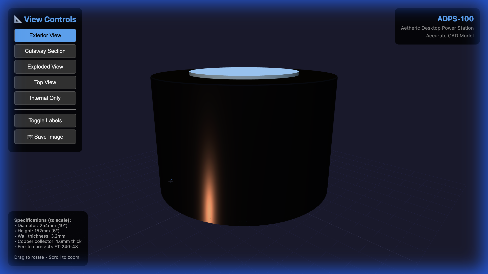
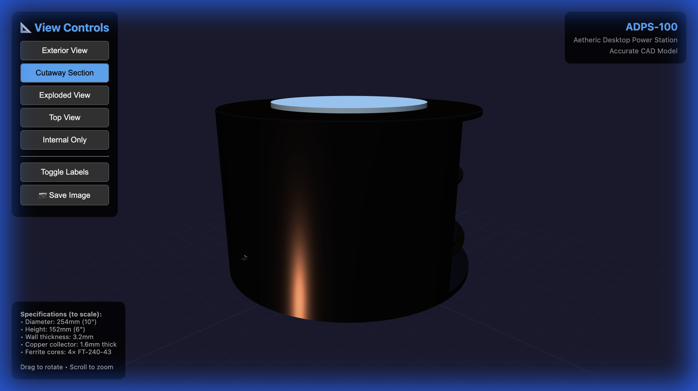
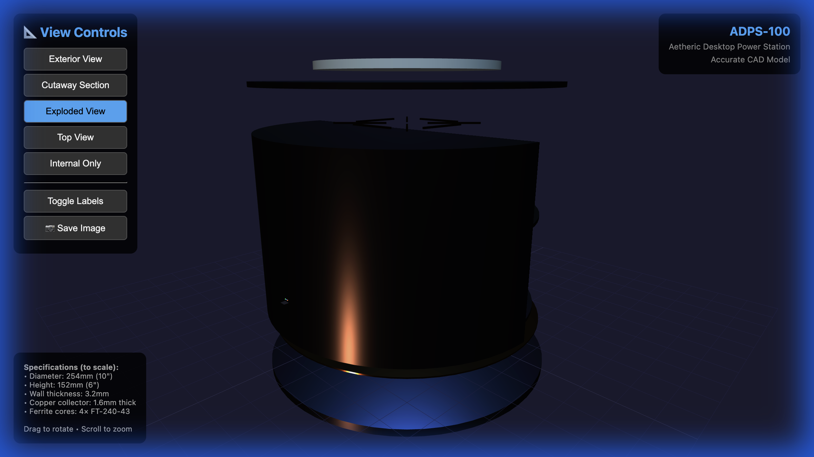
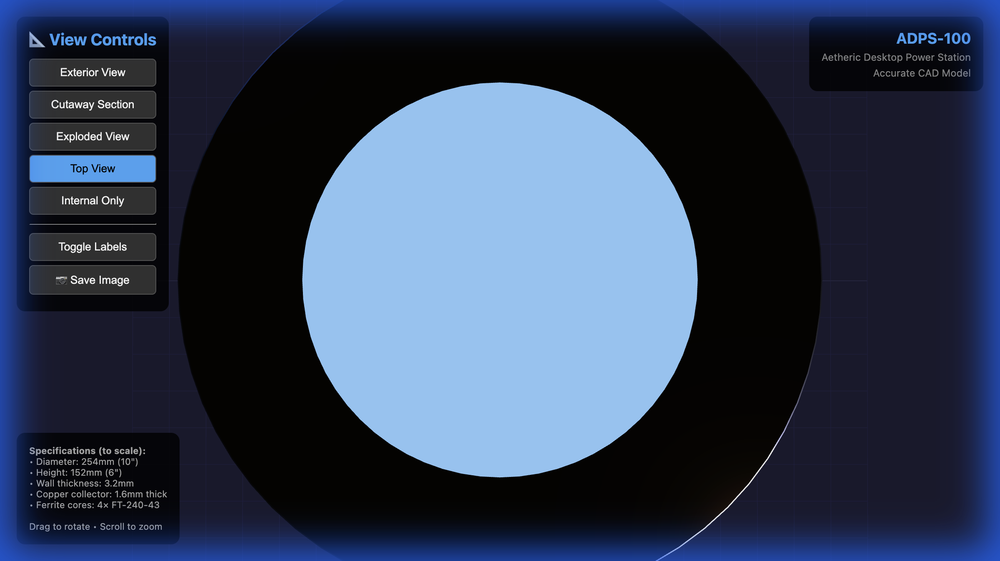
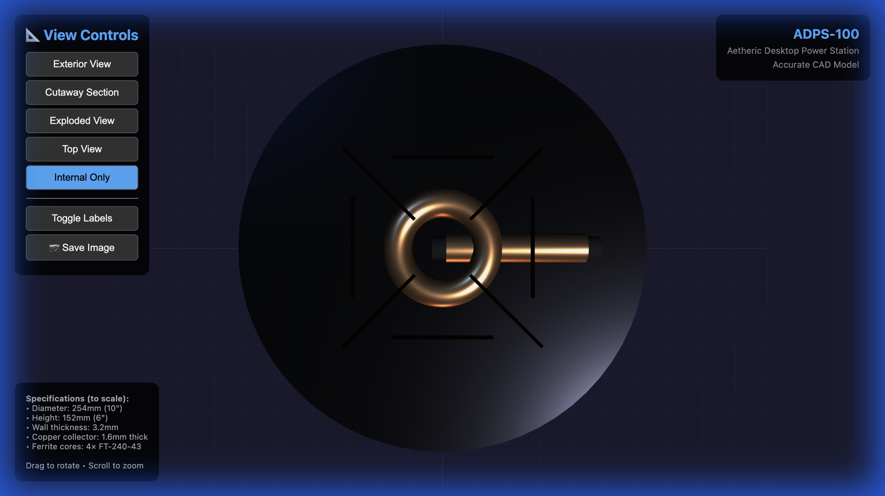
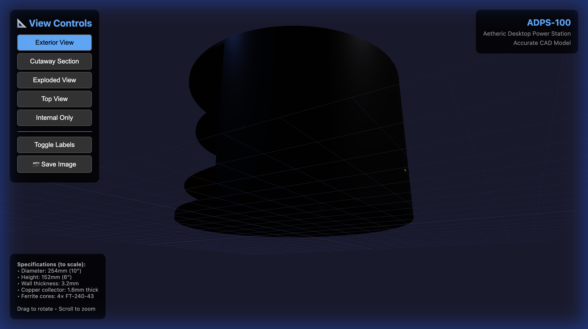

# 🔋 ADPS-100 Aetheric Desktop Power Station

## Complete Manufacturing & Technical Documentation

---

## 📸 Device Images (Accurate 3D Models)

### Exterior View



### Cutaway Section



### Exploded Assembly View



### Top View



### Internal Components Only



### Perspective View



---

## 🚀 HOW TO GET THIS DEVICE MANUFACTURED

### Step 1: Copy the Email

Open **[SEND_TO_MANUFACTURER/1_EMAIL_TEXT_COPY_THIS.txt](SEND_TO_MANUFACTURER/1_EMAIL_TEXT_COPY_THIS.txt)** and copy the entire contents.

### Step 2: Find a Manufacturer

Search on [Alibaba.com](https://www.alibaba.com) for:

- "Turnkey electronics assembly prototype"
- "OEM electronic device manufacturing Shenzhen"

Filter by: ✅ Trade Assurance ✅ Verified Supplier

### Step 3: Send the Message

Paste the email into Alibaba chat, then attach the 8 files from `SEND_TO_MANUFACTURER/` folder.

### Step 4: Wait for Quote

Expect response in 1-3 days with quote of $400-600 per unit.

---

## 📧 QUICK EMAIL (Copy This)

```
Subject: FULL TURNKEY Prototype - Need Finished Device Delivered (1 Unit)

Hello,

I need ONE manufacturer to handle EVERYTHING and deliver a FINISHED, WORKING device.
我需要一家制造商处理所有事情，并交付一个完成的、可工作的设备。

PROJECT:
• Desktop power station 254mm diameter × 152mm height
• CNC aluminum enclosure (black anodized)
• 2 PCBs with SMD components
• 2 custom wound coils
• USB-C + USB-A + Qi wireless charging

QUANTITY: 1 prototype
BUDGET: $400-600 USD fully assembled
TIMELINE: 4-6 weeks acceptable

Complete manufacturing files ready (~100MB).
Please provide email address to send complete package.

Can you do FULL TURNKEY? (manufacture + assemble + test + ship finished device)

Contact: nlhughes08@gmail.com
谢谢！
```

---

## 📁 Manufacturing Files

| File                                                                 | Description           |
| -------------------------------------------------------------------- | --------------------- |
| [PCB Gerbers](SEND_TO_MANUFACTURER/2_PCB_GERBERS.zip)                | PCB fabrication files |
| [BOM with LCSC](SEND_TO_MANUFACTURER/3_PCB_BOM.csv)                  | Complete parts list   |
| [CAD Files](SEND_TO_MANUFACTURER/4_ENCLOSURE_CAD.zip)                | STEP + DXF for CNC    |
| [Technical Drawings](SEND_TO_MANUFACTURER/5_TECHNICAL_DRAWINGS.md)   | Dimensions            |
| [Coil Specifications](SEND_TO_MANUFACTURER/6_COIL_SPECIFICATIONS.md) | Winding instructions  |
| [Assembly Manual](SEND_TO_MANUFACTURER/7_ASSEMBLY_MANUAL.md)         | Build guide           |
| [Firmware](SEND_TO_MANUFACTURER/8_FIRMWARE.hex)                      | STM32 program         |

---

## 📐 Specifications

| Parameter          | Value                                    |
| ------------------ | ---------------------------------------- |
| **Dimensions**     | 254mm (10") diameter × 152mm (6") height |
| **Weight**         | ~5.4 kg (12 lbs)                         |
| **Enclosure**      | 6061 Aluminum, black anodized            |
| **Collector**      | 99.9% pure copper, mirror polished       |
| **Primary Coil**   | Bifilar, 369 turns on 4× FT-240-43       |
| **Secondary Coil** | 500 turns on ferrite rod                 |
| **Controller**     | STM32F103C8T6                            |
| **Outputs**        | USB-C PD, 2× USB-A, Qi wireless          |
| **Display**        | 0.91" OLED + 3 status LEDs               |

---

## ⚡ How It Works

The ADPS-100 is based on Nikola Tesla's aetheric energy theory:

1. **Collection** - Copper plate collects atmospheric charge from aetheric field
2. **Resonance** - Bifilar coil creates scalar wave resonance at tuned frequency
3. **Amplification** - Voltage multiplied through Cockcroft-Walton circuit
4. **Output** - Regulated 5V/12V/20V for charging devices

### Self-Falsifying Experiment

- **If it works**: Display shows power in watts, LEDs light up
- **If it doesn't**: Display shows 0, LEDs stay dark
- **No battery** = No way to fake results

---

## 💰 Estimated Costs

| Component       | Cost         |
| --------------- | ------------ |
| PCB + Assembly  | $50-100      |
| CNC Enclosure   | $150-250     |
| Copper Parts    | $30-50       |
| Custom Coils    | $40-80       |
| Assembly + Test | $50-100      |
| Shipping (DHL)  | $50-80       |
| **TOTAL**       | **$400-650** |

---

## 📂 Repository Structure

```
aetherdevice/
├── SEND_TO_MANUFACTURER/    ← Files to send to factory
├── Images/                  ← 3D model renders
├── CAD/                     ← OpenSCAD source files
├── Electronics/             ← Schematics + firmware
├── Coils/                   ← Winding specifications
├── Documentation/           ← Assembly guides
├── BOM/                     ← Bill of materials
└── Visualization/           ← Interactive 3D viewer
```

---

## 🔗 Interactive 3D Viewer

Open in browser: [Visualization/accurate_3d_model.html](Visualization/accurate_3d_model.html)

Features:

- Exterior view
- Cutaway section
- Exploded assembly
- Top view
- Internal components only
- Save images button

---

## 📱 Contact

**Email:** nlhughes08@gmail.com

---

## 📜 License

Open source for experimental and educational purposes.
